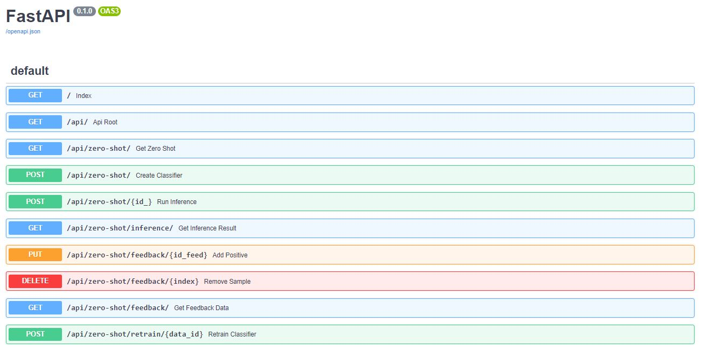

<h1 align="center">ZERO-SHOT CLASSIFICATION RESTAPI AND EXPLORATORY SEARCH</h1>

- Download fastapi folder or clone repository
- Install requirements.txt
- Execute from root directory (fastapi): `uvicorn src.fastapi:app`

#

#### Overview

This application is design for content-level exploration of documents collections. The idea is to guide the user into **molding a dataset** that he/she is not directly seeing. The dataset is then build around an initial topic. This topic will quiery Wikipedia databases to aggregate information from several articles (100 for the demo). Once the data is collected, the user can proceed to dynamically filter and rearrange the data for his/her research interest.

While the data collection process is being done, a data story is displayed to the user in real-time. The story is built with some short facts and interesting information about the query (root article), including some images and the most representative video aboout it. It's possible the apply zero-shot text classification to the collected articles to label them accordingly to the research interest.

The application was developed keeping in mind the context of *assisting research exploration for Human Sciences* but can naturally work for other areas.

The following is a demonstration for the queries: `Burning Man`, `Mariinsky Theatre`

https://user-images.githubusercontent.com/38184042/188108225-263783ea-1200-43c9-93c0-d742c7cac934.mp4

